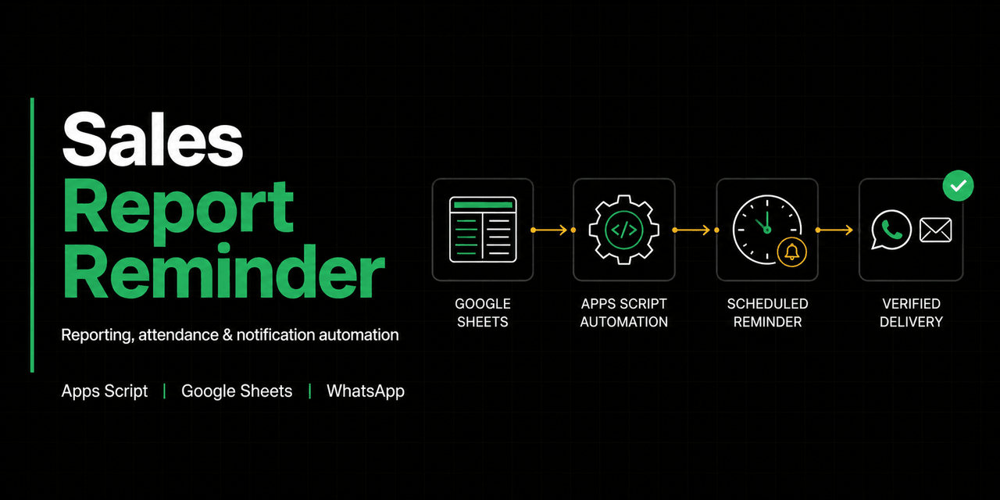
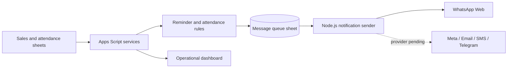

# Sales Report Reminder

Business reporting, attendance, and notification automation built around Google Sheets.



[](ROADMAP.md)
[](appsscript.json)
[](#architecture)
[](#implemented-capabilities)

[Live Dashboard](https://script.google.com/macros/s/AKfycbz_-_g2RfaJuJ_yNZ1z47Zj5YuGcuXYoWCAtlGJU4fBFB_D2kksI3NHHBPhU7FW8MI4/exec) | [Architecture](PROJECT.md) | [Configuration](CONFIG.md) | [Roadmap](ROADMAP.md) | [Security](SECURITY.md)

## Overview

Sales Report Reminder reduces manual follow-up across sales reporting and field operations. Apps Script reads governed spreadsheet data, calculates reminder and attendance states, writes an auditable message queue, and exposes operational controls through Google Sheets. A separate Node.js sender consumes queued work and dispatches through enabled notification providers.

## Implemented Capabilities

- Spreadsheet menu for sales copy, reminder, attendance, queue, and dashboard operations
- Daily reminder processing with test-recipient controls
- Attendance synchronization and summary generation
- Append-oriented queue logging, retries, and completed-message cleanup
- Runtime configuration managed in Dashboard columns C:E
- Decoupled notification sender with WhatsApp Web support
- Provider boundaries for Meta, Telegram, email, and SMS; these remain placeholders until configured and verified

## Architecture



## Technology Stack

| Area | Technology |
| --- | --- |
| Workflow runtime | Google Apps Script V8 |
| Operational data | Google Sheets |
| Sender service | Node.js, Google APIs |
| Verified delivery path | WhatsApp Web |
| Deployment tooling | clasp |

## Setup

### Apps Script

1. Clone the repository and authenticate `clasp`.
2. Bind the project to a controlled Google Sheet.
3. Configure the required tabs and settings described in [CONFIG.md](CONFIG.md).
4. Store provider credentials in Script Properties or the protected settings source; never place them in code.
5. Run `runEnvironmentSetup` and verify behavior with synthetic data and test mode enabled.

### Notification sender

```bash
cd notification-sender
npm install
```

Copy `.env.example` to `.env`, provide a development sheet ID and service-account credential through the deployment environment, then run:

```bash
npm start
```

## Repository Structure

```text
src/                     Apps Script configuration, services, and triggers
notification-sender/     Decoupled queue consumer and notification providers
Code.js                  Bound-script compatibility entry point
response.html            Apps Script web response surface
CONFIG.md                Runtime and spreadsheet configuration
PROJECT.md               Architecture and coding conventions
ROADMAP.md                Verified delivery status and next priorities
```

## Screenshots

Operational screens can contain employee, customer, phone, attendance, and sales data. They are intentionally not published. The architecture and social preview communicate the workflow without exposing business records.

## Verification

The repository is validated with JavaScript syntax checks. Full end-to-end verification requires a bound Google Sheet, Apps Script triggers, provider credentials, and test recipients in a non-production environment.

## Security

Read [SECURITY.md](SECURITY.md) before deployment. The Apps Script manifest currently permits anonymous web-app access; review whether that is required for the intended deployment and restrict it when possible.

## Contributing and License

See [CONTRIBUTING.md](CONTRIBUTING.md). No repository-wide open-source license has been selected; the nested notification-sender package currently declares ISC metadata.

---

**Md. Masum Billah** · Data Analyst | Automation Developer | Business Intelligence Specialist

[Portfolio](https://itsmebillah.github.io/) · [GitHub](https://github.com/itsmebillah) · [LinkedIn](https://www.linkedin.com/in/itsmebillah/) · [Email](mailto:itsmbillah@gmail.com) · [Live Dashboard](https://script.google.com/macros/s/AKfycbz_-_g2RfaJuJ_yNZ1z47Zj5YuGcuXYoWCAtlGJU4fBFB_D2kksI3NHHBPhU7FW8MI4/exec) · [Documentation](PROJECT.md)
